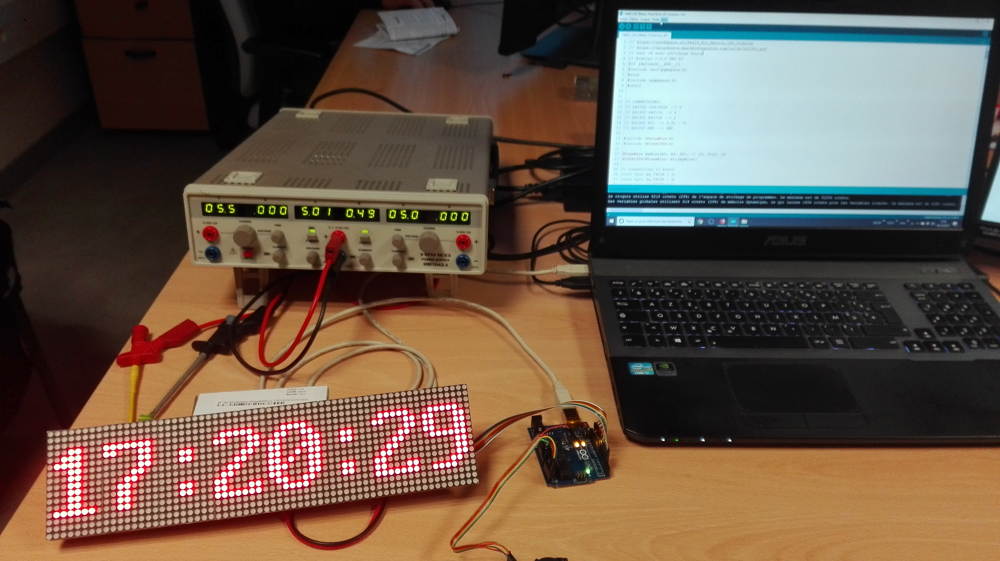

# Project Name

arduino-ledmatrix-16x64-display-time

## Installation

- Library: Rtc by Makuna by Michael C. Miller (Version2.3.0)

## Usage to display Time on 16x64 LED matrix

- Arduino Uno
- LED matrix 16x64

### Datasheet of matrix led components

- 74HC595 : [Registre à décalage](https://www.robot-maker.com/forum/tutorials/article/117-registre-a-decalage-74hc595/)
- 74HC138 : [3-to-8 line decoder/demultiplexer; inverting](https://www.diodes.com/assets/Datasheets/74HC138.pdf)
- 74HC04 : [Hex inverter](https://assets.nexperia.com/documents/data-sheet/74HC_HCT04.pdf)
- TC4953 : [FET Type,  P-Channel](https://lcsc.com/product-detail/MOSFET_Shenzhen-Fuman-Elec-TC4953_C111618.html)

## Contributing

1. Fork it!
2. Create your feature branch: `git checkout -b my-new-feature`
3. Commit your changes: `git commit -am 'Add some feature'`
4. Push to the branch: `git push origin my-new-feature`
5. Submit a pull request :D

## History

TODO: Write history

## Credits

- [Site4U](https://nurdspace.nl/64x16_Dot_Matrix_LED_Display)
- me

## License

see [LICENSE](/LICENSE) file
